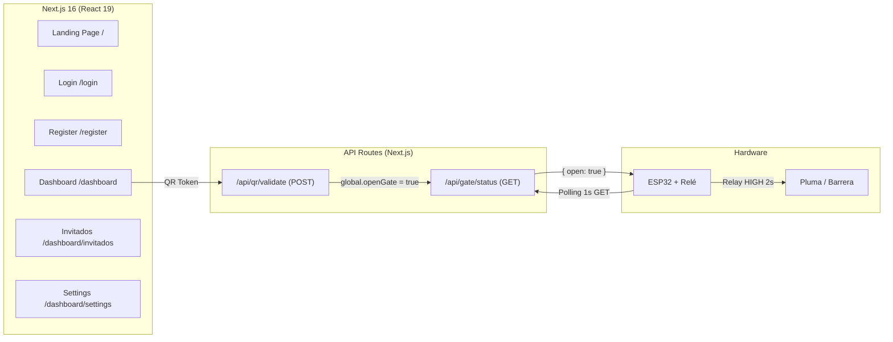

# PARQR — Arquitectura del Sistema

## Visión General

PARQR es un sistema de control de acceso por código QR para fraccionamientos residenciales. Un residente genera un QR dinámico desde la webapp, lo presenta en la caseta, y un ESP32 acciona la pluma automáticamente.

## Diagrama de Arquitectura



## Stack Tecnológico

| Capa | Tecnología | Versión |
|------|-----------|---------|
| Frontend | Next.js (App Router) + React | 16.1.6 / 19.2.4 |
| Estilos | Vanilla CSS + Google Fonts (Inter) | — |
| Iconos | lucide-react | 0.577.0 |
| QR | qrcode.react | 4.2.0 |
| IoT | ESP32 + Arduino (WiFi, HTTPClient) | — |
| Infraestructura | Docker (node:20-alpine), Docker Compose | — |

## Flujo Principal de Acceso

1. El residente inicia sesión en la webapp
2. El dashboard genera un token QR que se renueva cada 60 segundos
3. El residente presenta el QR al escáner de la caseta
4. El escáner envía el token a `POST /api/qr/validate`
5. El servidor valida el token y activa `openGate = true` por 10 segundos
6. El ESP32 consulta `GET /api/gate/status` cada 1 segundo
7. Al recibir `{ open: true }`, activa el relé 2 segundos para abrir la pluma
8. Tras 5 segundos de espera, vuelve a consultar

## Estructura del Proyecto

```
PARQR/
├── src/
│   ├── app/
│   │   ├── page.jsx              # Landing page
│   │   ├── layout.jsx            # Root layout
│   │   ├── globals.css           # Design system
│   │   ├── login/page.jsx        # Página de login
│   │   ├── register/page.jsx     # Página de registro
│   │   ├── dashboard/
│   │   │   ├── page.jsx          # Dashboard principal (QR)
│   │   │   ├── invitados/page.jsx
│   │   │   └── settings/page.jsx
│   │   └── api/
│   │       ├── qr/validate/route.js   # Validación de QR
│   │       └── gate/status/route.js   # Estado de la pluma
│   └── components/
│       ├── TopNav.jsx            # Navegación pública
│       ├── AuthLayout.jsx        # Layout de auth
│       └── DashboardLayout.jsx   # Layout del dashboard
├── esp32_pluma_acceso/
│   └── esp32_pluma_acceso.ino    # Firmware del ESP32
├── Dockerfile
├── docker-compose.yml
├── package.json
└── docs/                         # ← Estás aquí
```
