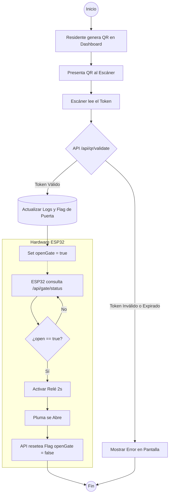
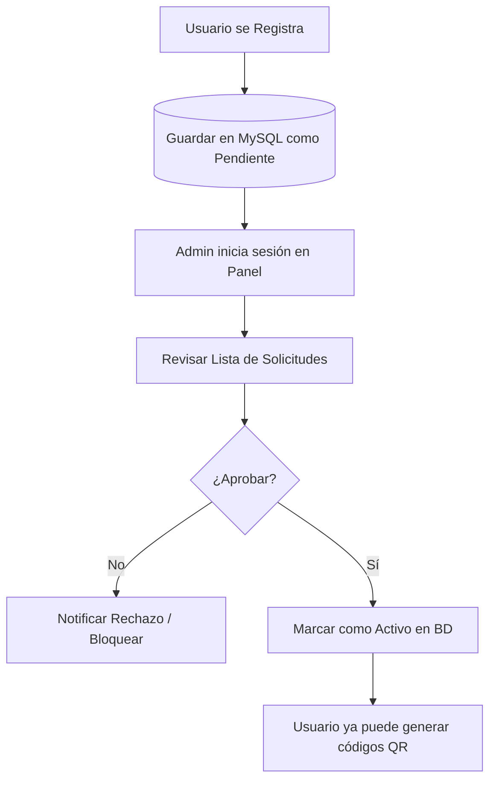
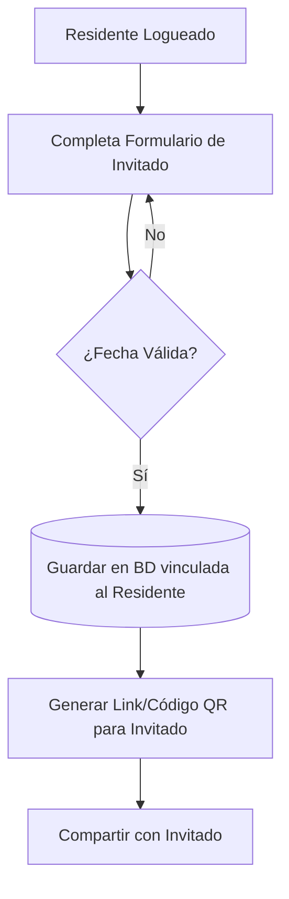

# Diagramas de Flujo - Proyecto PARQR

Este documento detalla los flujos lógicos principales del sistema, desde la generación del acceso hasta la activación física de la barrera.

## 1. Flujo Global de Acceso (Residente/Invitado)

Este diagrama describe el proceso desde que se presenta el código QR hasta que la pluma se abre.

## 2. Flujo de Registro y Aprobación de Residentes

Lógica de seguridad para asegurar que solo personas autorizadas usen el sistema.

## 3. Flujo de Creación de Invitaciones Temporales

