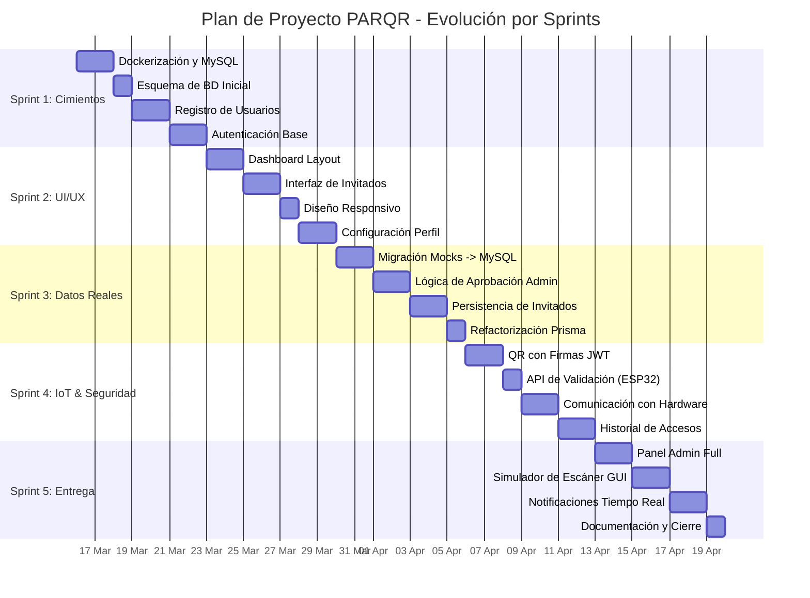

# Diagrama de Gantt - Proyecto PARQR

Este diagrama detalla la planificación de los 5 sprints del proyecto, abarcando desde la infraestructura inicial hasta la entrega final y el pulido del sistema.

## Resumen de Fases

1.  **Fase de Cimientos (Semana 1):** Establecimiento del entorno Docker y seguridad básica.
2.  **Fase de Experiencia (Semana 2):** Desarrollo visual y adaptabilidad móvil.
3.  **Fase de Robustez (Semana 3):** Conexión real a base de datos y flujos de negocio.
4.  **Fase de Conectividad (Semana 4):** Integración con el hardware (ESP32) y blindaje de tokens QR.
5.  **Fase de Finalización (Semana 5):** Herramientas administrativas avanzadas y simuladores de pruebas.
